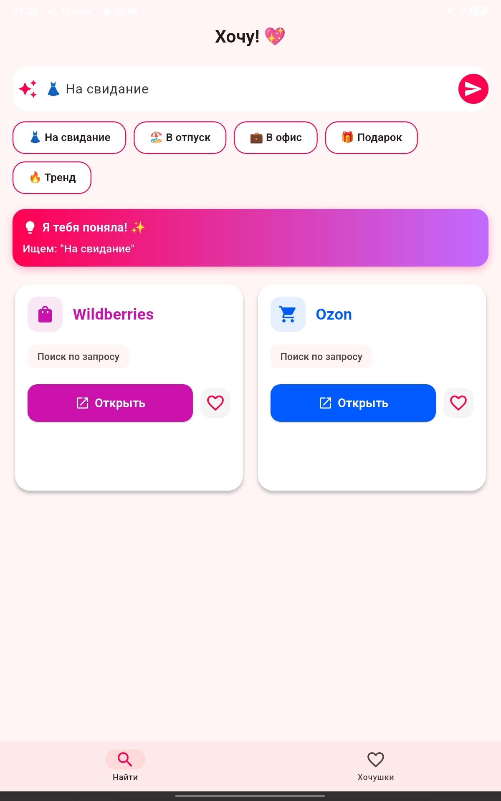
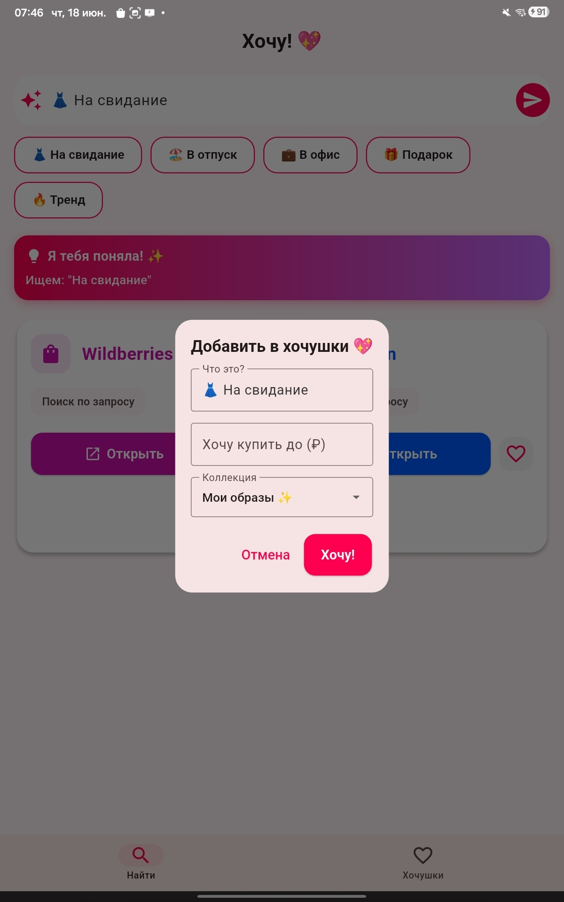

# Хочу! 💖

[](https://flutter.dev)
[](https://dart.dev)
[](https://opensource.org/licenses/MIT)
[](https://github.com/m0nk0/khochu-app)

**AI-помощник для умного шопинга на Wildberries и Ozon**


---

## 🎯 Что это такое?

**Хочу!** — это не просто приложение для поиска товаров. Это ваш личный AI-помощник, который:

- ✨ **Понимает вас с полуслова** — пишите как в чате с подругой: "белая футболка хлопок дешевле 1000"
- 🛍️ **Сравнивает маркетплейсы** — мгновенный поиск на Wildberries и Ozon с умными фильтрами
- 💖 **Создаёт коллекции** — сохраняйте товары в "Хочушки", устанавливайте целевую цену
- 🎨 **Радует дизайном** — TikTok-стиль, конфетти, милый маскот Хоша и плавные анимации
- 📊 **Показывает реальные цены** — интеграция с ePN API для получения актуальных товаров

---

## 🚀 Возможности

### 🤖 Умный AI-поиск
- Понимает естественный язык на русском
- Автоматически извлекает цену, цвет, материал из запроса
- Оптимизирует запрос для алгоритмов маркетплейсов
- История поисков в один клик

### 💰 Экономия времени и денег
- Не нужно вручную настраивать фильтры
- Сравнение цен между WB и Ozon
- Отслеживание целевой цены
- Уведомления о скидках *(в разработке)*

### 🎁 Социальные фичи
- Сохранение в коллекции ("Гардероб 2024", "Подарки", "Дом")
- Поделиться находкой с подругой *(в разработке)*
- Геймификация: достижения и статистика экономии *(в разработке)*

### 🎨 Дизайн и UX
- Яркий TikTok-стиль с градиентами
- Конфетти при сохранении товара 🎉
- Милый маскот Хоша с разными эмоциями
- Адаптивность под смартфоны и планшеты

---

## 📱 Скриншоты

### Главный экран и AI-поиск


### Диалог сохранения товара


### Коллекции "Хочушки"


---

## 🛠️ Технологии

- **Flutter 3.x** — кроссплатформенная разработка
- **Dart** — типизированный язык
- **Material Design 3** — современный UI
- **SharedPreferences** — локальное хранение данных
- **Deep Links** — интеграция с маркетплейсами
- **Confetti** — праздничные анимации 🎉
- **ePN API** — партнерская сеть для получения реальных товаров

---

## 📦 Установка

### Для разработчиков

1. Клонируйте репозиторий:
```bash
git clone https://github.com/m0nk0/khochu-app.git
cd khochu-app
```

2. Установите зависимости:
```bash
flutter pub get
```

3. Запустите приложение:
```bash
flutter run
```

### Для пользователей

**Android:**
- Скачайте APK из [Releases](https://github.com/m0nk0/khochu-app/releases) *(скоро)*
- Или соберите сами: `flutter build apk --release`

**iOS:**
- Требуется macOS и Xcode
- Соберите: `flutter build ios --release`

---

## 🗺️ Roadmap

### ✅ Реализовано
- [x] AI-парсинг естественного языка
- [x] Deep Links для WB и Ozon
- [x] Коллекции "Хочушки"
- [x] Анимации и конфетти
- [x] Маскот Хоша
- [x] GitHub Pages сайт
- [x] Регистрация в ePN

### 🚧 В разработке
- [ ] Интеграция CPA API (ePN) — получение реальных товаров
- [ ] Реальное сравнение цен в приложении
- [ ] Кнопка "Поделиться находкой"
- [ ] Push-уведомления о скидках
- [ ] Тёмная тема
- [ ] Публикация в Google Play / App Store

---

## 🤝 Вклад

Pull requests приветствуются! Для серьёзных изменений сначала создайте issue.

1. Форкните репозиторий
2. Создайте ветку для фичи (`git checkout -b feature/AmazingFeature`)
3. Закоммитьте изменения (`git commit -m 'Add some AmazingFeature'`)
4. Запушьте в ветку (`git push origin feature/AmazingFeature`)
5. Откройте Pull Request

---

## 📄 Лицензия

Этот проект распространяется под лицензией MIT — см. файл [LICENSE](LICENSE) для деталей.

---

## 👨‍💻 Автор

**m0nk0**  
GitHub: [@m0nk0](https://github.com/m0nk0)

---

## 🔗 Ссылки

- **Сайт проекта:** [https://m0nk0.github.io/khochu-app/](https://m0nk0.github.io/khochu-app/)
- **ePN партнерская сеть:** [https://epn.bz](https://epn.bz)

---

<div align="center">

**Сделано с 💖 для умного шопинга**

[⭐ Поставьте звезду, если понравилось!](https://github.com/m0nk0/khochu-app)

</div>